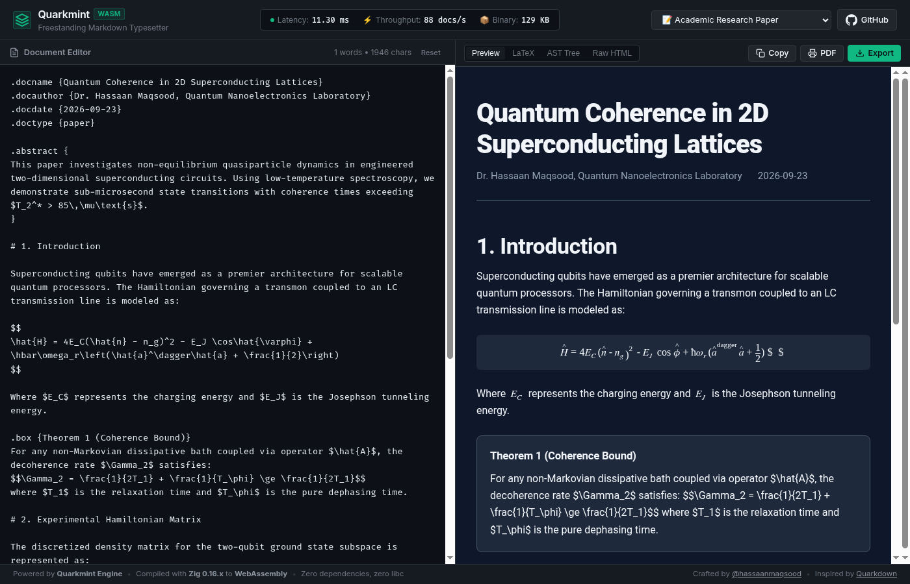

<div align="center">

# Quarkmint

**Fast, programmable Markdown typesetting for the web and desktop**

[](https://github.com/hassaanmaqsood/quarkmint/actions/workflows/ci.yml)
[](https://hassaanmaqsood.github.io/quarkmint/)
[](https://webassembly.org/)
[](https://ziglang.org/)
[](https://hassaanmaqsood.github.io/quarkmint/)
[](LICENSE)

<br/>

**[Try the Live Demo](https://hassaanmaqsood.github.io/quarkmint/)** • **[Features](#features)** • **[Quickstart](#quickstart)** • **[How it Works](#how-it-works)** • **[Inspiration](#inspiration)**

</div>

---

## What is Quarkmint?

**Quarkmint** is an open-source Markdown typesetter written in [Zig](https://ziglang.org/) and compiled to [WebAssembly](https://webassembly.org/).

It takes normal Markdown and adds features needed for technical and academic writing — like math equations, custom layout boxes, variables, and reusable templates. Because it is written in Zig and compiles to WebAssembly, it runs directly in your browser with no installation required, or as a single, fast command-line tool on your computer.

---

## Live Playground

You can try Quarkmint right in your browser without installing anything:

👉 **[Open the Live Playground](https://hassaanmaqsood.github.io/quarkmint/)**



- **Instant Preview**: Type on the left, see the rendered document on the right.
- **Pure Browser Wasm**: Runs 100% locally on your machine. Nothing is sent to a server.
- **Multiple Views**: Switch between rendered HTML, LaTeX source code, and parsed document structure.
- **In-Browser PDF Export**: Export or print publication-ready vector A4 PDFs directly from the browser toolbar.
- **Example Presets**: Includes templates for research papers, math notes, custom macros, and layout grids.

---

## Features

- **⚡ Blazing Fast**: Compiles typical documents in less than a millisecond (~94 microseconds).
- **🌐 Runs Everywhere**: Runs natively on Linux, macOS, and Windows, or in any web browser via a tiny 129 KB WebAssembly file.
- **📐 Math & Equations**: Full support for inline math (`$E = mc^2$`) and display formulas (`$$\int_0^\infty ...$$`).
- **📝 HTML, LaTeX & PDF Output**: Compiles documents into clean standalone HTML pages, production-ready LaTeX, or vector A4 PDFs.
- **🧩 Custom Variables & Functions**: Define reusable variables (`.set {name value}`) and custom functions (`.function {tag arg} ...`) directly in your document.
- **🍱 Boxes & Alerts**: Add styled note boxes (`.box {Title}`), warnings (`.warning`), and multi-column layouts (`.row`, `.col`).
- **📁 File Includes**: Split long documents into multiple files with `.include {path}`.
- **🛠️ Built-in Tools**:
  - `quarkmint file.qmd`: Compile a document to HTML, LaTeX, or PDF
  - `quarkmint doc folder`: Build an entire folder of docs into a static website
  - `quarkmint lsp`: Run the language server for editor autocomplete
  - `quarkmint graph file.qmd`: Visualize how your subdocuments link together

---

## Performance

Quarkmint was designed from day one to be fast and lightweight. Here is how it compares on a standard benchmark of 1,000 documents:

| Measurement | Quarkmint (WebAssembly) | Typical Node / Python Markdown Tools |
| :--- | :--- | :--- |
| **Time per Document** | **~0.09 ms (94 microseconds)** | 15 – 80 ms |
| **Documents per Second** | **10,000+ docs/sec** | 20 – 60 docs/sec |
| **Engine Size** | **129 KB** | 10 – 100 MB |
| **Dependencies** | **Zero (self-contained)** | Node, Python, or heavy npm packages |

---

## Quickstart

### 1. Command Line Tool

Build the CLI binary with Zig:

```bash
# 1. Download the code
git clone https://github.com/hassaanmaqsood/quarkmint.git
cd quarkmint

# 2. Build the binary (CLI + Wasm)
zig build

# 3. Check that it works
./zig-out/bin/quarkmint --version
```

#### Compile a document to HTML:
```bash
./zig-out/bin/quarkmint input.qmd -o document.html
```

#### Compile a document to LaTeX:
```bash
./zig-out/bin/quarkmint input.qmd --latex -o document.tex
```

#### Compile directly to PDF:
```bash
./zig-out/bin/quarkmint input.qmd --pdf -o document.pdf
```

---

### 2. JavaScript / Node.js

You can load and use the WebAssembly engine in JavaScript or Node.js:

```javascript
import { loadQuarkmint } from './main.js';

// Load the engine
const qm = await loadQuarkmint('./zig-out/lib/quarkmint.wasm');

const doc = `
# My Document

Here is an equation: $E = mc^2$

.box {Important}
This was compiled in WebAssembly!
`;

// Compile to HTML
const html = qm.compile(doc);
console.log(html);

// Or compile to LaTeX
const latex = qm.compileLatex(doc);
console.log(latex);
```

---

### 3. In the Browser

```html
<script type="module">
  import { loadQuarkmint, attachLivePreview } from './main.js';

  const qm = await loadQuarkmint('./quarkmint.wasm');
  const input = document.querySelector('#editor');
  const preview = document.querySelector('#preview');

  // Automatically update preview as the user types
  attachLivePreview(input, preview, qm, true);
</script>
```

---

## How it Works

Quarkmint processes documents in simple, fast stages:

```
[Markdown Input]
       │
       ▼
   [ Lexer ]       Reads text directly without copying memory
       │
       ▼
   [ Parser ]      Builds an Abstract Syntax Tree (AST) in a fast memory pool
       │
       ▼
  [ Evaluator ]    Runs functions (.function), sets variables (.set), and includes files
       │
       ├───────────────────────────────┐
       ▼                               ▼
  [ HTML Renderer ]             [ LaTeX Renderer ]
       │                               │
       ▼                               ▼
Standalone HTML Page            Clean LaTeX Document
```

---

## Running the Tests

To verify that everything is working properly:

```bash
# Run all native Zig tests (checks all 37 modules for memory leaks)
zig build test

# Run the golden output tests and speed benchmark
node test/golden.js

# Start the local browser playground
npm run serve
# Visit http://localhost:8080/ in your browser
```

---

## Inspiration

Quarkmint was inspired by **[Quarkdown](https://github.com/)**, an exciting project that showed how Markdown could be expanded into a programmable typesetting language.

Quarkmint rebuilds these ideas from scratch in Zig and WebAssembly to make the engine fast, tiny, and capable of running anywhere — from browser tabs to terminal scripts. We hope to contribute ideas, parser improvements, and Wasm features back to the Quarkdown ecosystem as open-source companions in the future.

---

## License

This project is licensed under the **MIT License**. See the [`LICENSE`](LICENSE) file for details.

Created and maintained by **[Hassaan Maqsood](https://github.com/hassaanmaqsood)**.
